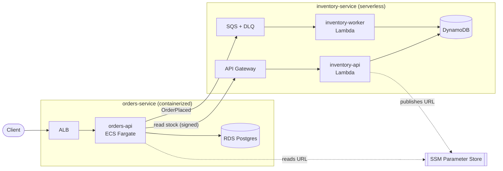

# Architecture

A small ordering system on AWS, split across two services. It's built so it can
be moved to GCP or Azure later without a rewrite: the application code stays put,
and the work is migrating the data and swapping a few adapter files.

## The two services

- **orders-service** — an order API on ECS Fargate behind an ALB, backed by RDS
  Postgres.
- **inventory-service** — stock tracking on two Lambdas (a read API behind API
  Gateway, and an SQS worker), backed by DynamoDB.

Each team owns one repo, with its application code and infrastructure together.

## How the two services talk

orders-service calls inventory in two ways:

- **Synchronously** to check stock before accepting an order. The API Gateway
  route uses IAM auth, so the call is SigV4-signed with the task role. No API
  keys or shared secrets.
- **Asynchronously** by publishing an `OrderPlaced` message to SQS. The worker
  picks it up and decrements stock with a conditional write.

They don't share Terraform state. inventory-service writes its API URL to SSM
Parameter Store and orders-service reads it from there. Either service can deploy
first, and they could run in separate AWS accounts without changing anything.

## Why the services have different shapes

One is containerized, one is serverless. That's on purpose — it covers both
common patterns and gives two different migration paths to reason about.

| | orders-service | inventory-service |
|---|---|---|
| Pattern | Containerized | Serverless |
| Compute | ECS Fargate + ALB | 2 Lambdas + API Gateway |
| Store | RDS Postgres | DynamoDB |
| Network | VPC, public + private subnets, no NAT | No VPC |

The inventory Lambdas only reach DynamoDB, SQS, and SSM, which are all public AWS
endpoints, so they don't need a VPC. orders-service does, because its Fargate
tasks talk to a private RDS instance.

## Moving off AWS

The business logic doesn't import boto3 or know it runs on Lambda. The
AWS-specific code is kept to a few files, so migrating compute means swapping
those rather than touching the logic:

- `lambda_api.py` (Mangum adapter) → run the same FastAPI app under uvicorn in a
  container.
- `lambda_worker.py` (SQS handler) → run the same handler from a KEDA-scaled
  poller.
- `dynamo.py` (DynamoDB) → a Firestore or Cosmos implementation behind the same
  `StockRepository` interface.

The data is the real work, and it splits cleanly:

- **Postgres is straightforward.** RDS to Cloud SQL or Azure Database for
  PostgreSQL is mostly managed logical replication. The schema is already set up
  for it: every table has a primary key, and `updated_at` is maintained by a
  trigger.
- **DynamoDB is the hard part.** There's no equivalent managed service on GCP or
  Azure, and no near-zero-downtime migration tool for it. Keeping every DynamoDB
  call behind the `StockRepository` interface contains that work to one file
  instead of spreading it through the codebase.

For the full per-dependency breakdown, see the
[AWS-coupling table](../README.md#aws-coupling-inventory--the-bridge-to-phase-2)
in the platform README.
