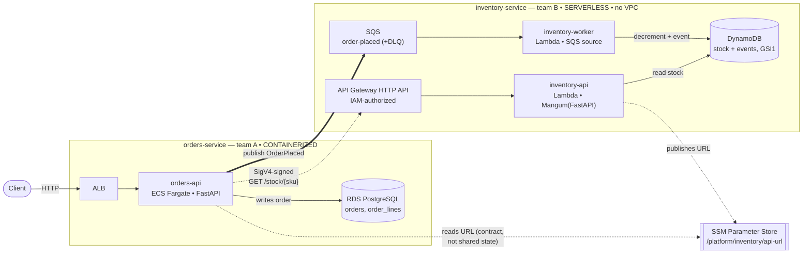
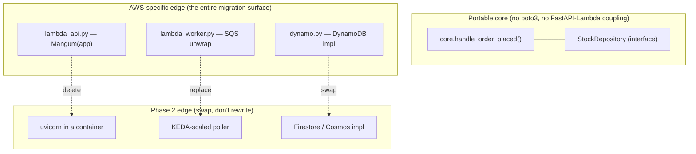

# Architecture

An AWS-native "before" system, designed so a later migration off AWS is a
data-migration problem plus a redeploy — not a rewrite.

> **Ephemeral compute is portable; persistent state is not.** Draw the seam
> there, and the migration cost concentrates where it actually lives: the
> stateful stores.

## System

**Two paths between the teams, one contract seam:**

- **Sync** (dashed): `orders-api` reads stock from inventory's API Gateway before
  accepting an order. The route is IAM-authorized, so the call is SigV4-signed
  with the task role — no API keys, no static secrets.
- **Async** (bold): `orders-api` publishes `OrderPlaced` to SQS; the worker
  decrements stock with a conditional write and logs the movement.
- **Contract, not shared state**: inventory publishes its URL to SSM; orders
  reads it. Neither team touches the other's Terraform state, so either can
  deploy first and they can live in separate accounts unchanged.

## Why the two services look different

The asymmetry is deliberate — a realistic portfolio, not a symmetric diagram.

| | orders-service | inventory-service |
|---|---|---|
| Pattern | **Containerized** | **Serverless** |
| Compute | ECS Fargate + ALB | 2 Lambdas + API Gateway |
| Store | RDS PostgreSQL | DynamoDB |
| Network | VPC (public + private, **no NAT**) | **No VPC** |
| Migration seam | clean (managed logical replication) | hard (no equivalent service) |

## The migration seam (what Phase 2 exploits)

Business logic never knows what invoked it or what stores it. The AWS coupling
is confined to named, deletable files:

The full per-dependency portability rating is in the
[platform README](../README.md#aws-coupling-inventory--the-bridge-to-phase-2).

## The honest finding

Migration difficulty tracks the store, not the compute:

- **Postgres → Cloud SQL / Azure Flexible Server: easy.** Managed logical
  replication; the schema is already replication-ready (every table has a PK;
  `updated_at` is trigger-maintained).
- **DynamoDB → anything: hard.** No equivalent managed service, and no
  first-party near-zero-downtime tooling on either cloud. The repository
  interface is what turns that from a rewrite into a swappable implementation.

Naming that asymmetry up front — and designing the source so the easy half stays
easy and the hard half is contained — is the actual demonstration of migration
experience.
