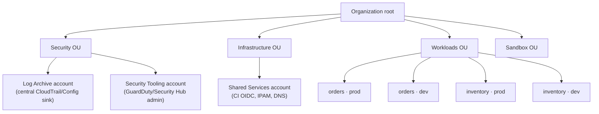

# Landing zone standards

The account-and-org baseline every team's workload lands on. This is the
reference architecture the two service repos in this sample *assume but do not
build* — they run in a single account as a
[documented shortcut](adr/0003-cost-decisions.md#the-one-account-demo-shortcut).
This document is the standard the shortcut points at.

It is written **AWS-first** (the current platform), with a mapping to the GCP and
Azure equivalents at the end, because the migration target is those two clouds.

> **Scope.** A landing zone is the *organization-level* baseline: how accounts are
> carved up, who can do what in them, what every account gets for free (logging,
> guardrails, tags), and how a new team gets an account. It is **not** the
> per-workload IaC — that lives in each service repo and is described in
> [TERRAFORM_TERRAGRUNT.md](../../TERRAFORM_TERRAGRUNT.md).

---

## 1. Account topology

**Standard: one account per team, per environment**, grouped into Organizational
Units under AWS Organizations. The account is the blast-radius and billing
boundary; the OU is where guardrails and access attach.

**Why account-per-team, not one shared account with IAM boundaries.** IAM in a
shared account is a permission model; separate accounts are a *default-deny
blast radius*. A runaway `terraform destroy`, a leaked credential, or a Config
drift is contained to one team's one environment. It also makes cost
attribution exact at the billing layer, above whatever tags say.

**How this sample already gets halfway there.** The two repos isolate Terraform
state by a per-team S3 key prefix
([root.hcl](../../orders-service/infra/root.hcl#L31):
`key = "${team}/…/terraform.tfstate"`), so two teams never share a state path
even in one account. Promoting that seam from *key prefix* to *account boundary*
is the whole change — and the code is already shaped for it: only
`aws_account_id` and the assumed OIDC role ARN differ per team. Everything else
in `root.hcl` is identical by construction.

---

## 2. Identity & access

**Standard: humans via SSO, machines via OIDC. No long-lived IAM users, ever.**

- **Humans** — AWS IAM Identity Center (SSO), with permission sets assigned per
  OU. A developer gets read-mostly access to their team's `dev` account and
  read-only to `prod`; break-glass admin is a separate, alarmed permission set.
- **CI/CD** — GitHub Actions authenticates via **OIDC federation** and assumes a
  per-team deploy role scoped to that team's account. This is the pattern the
  sample's shared CI already uses (see the reusable workflows referenced in
  [ADR 0001](adr/0001-service-repos-own-their-iac.md)); the landing zone just
  makes the trust policy per-account instead of per-key-prefix. No access keys
  are ever minted or stored.

**Why this is non-negotiable.** Long-lived keys are the single most common cloud
breach vector and the hardest to rotate. OIDC-issued, short-lived credentials
remove the secret entirely — there is nothing to leak.

---

## 3. Network baseline

**Standard: per-account VPC with centrally-allocated CIDRs; shared egress only
when a workload actually needs it.**

- **CIDR allocation** — AWS IPAM in the Shared Services account hands each
  account a non-overlapping range, so accounts can be peered or attached to a
  Transit Gateway later without renumbering.
- **Egress** — added *when a workload needs it*, not by default. This sample
  deliberately runs **no NAT Gateway** — Fargate tasks sit in public subnets
  with tight security groups, and RDS has no internet route at all
  ([ADR 0003](adr/0003-cost-decisions.md)). A NAT is ~$32/mo plus data
  processing; a landing zone that mandates one per account taxes every team for
  egress most of them don't use. The standard is therefore **centralized egress
  in the Shared Services account as an opt-in**, shared across accounts that need
  it, rather than a NAT per spoke.
- **DNS** — a central private hosted zone in Shared Services, associated to spoke
  VPCs.

**Why opt-in egress.** The cheapest, most secure network path is no egress. The
landing zone should make "no internet route" the easy default and shared egress
the deliberate exception — the same cost stance the workloads already take.

---

## 4. Guardrails

**Standard: preventive controls as SCPs, detective controls as Config. The org
enforces what a per-repo linter otherwise would.**

Baseline **Service Control Policies** applied at the OU level:

- Deny leaving the organization / removing the account from the org.
- Deny disabling or tampering with CloudTrail, Config, or GuardDuty.
- Region lock — deny API calls outside approved regions (`us-west-2` here).
- Deny making S3 buckets or EBS snapshots public.
- Deny root-user access-key creation.

Baseline **AWS Config conformance packs** for detective controls: encryption at
rest, no `0.0.0.0/0` on sensitive ports, required-tags compliance.

**Why guardrails at the org, not policy-as-code per repo.**
[ADR 0001](adr/0001-service-repos-own-their-iac.md) deliberately ships *no
OPA/Conftest pack* — required-tag enforcement is already structural via
`default_tags`, and checkov covers the security baseline in CI. Guardrails are
the org-scoped counterpart of that same philosophy: an SCP that denies public S3
across every account is worth more than the same rule copy-pasted into fifty
repos' pipelines, because it holds even for resources created by hand or by a
pipeline that skipped the scan. **SCPs are a floor no team can drop below;
checkov is per-repo hygiene above it.**

---

## 5. Centralized logging & audit

**Standard: every account's audit trail lands in one account no team can write
to.**

- **Org-level CloudTrail** with an organization trail delivering every account's
  events to a central bucket in the dedicated **Log Archive** account. Member
  accounts can read nothing and delete nothing there.
- **AWS Config** aggregated to the same account.
- **GuardDuty and Security Hub** with the **Security Tooling** account as
  delegated administrator, so findings across the whole org surface in one place.

**Why a separate Log Archive account.** If audit logs live in the same account as
the workload, the credential that compromises the workload can erase its own
tracks. A write-once sink in an account the workload has no access to is the
control that makes the audit trail trustworthy.

---

## 6. Tagging & FinOps

**Standard: promote the workloads' structural tagging to an org tag policy, and
budget per account/OU.**

The two repos already apply `Project`, `Team`, `CostCenter`, `Environment`, and
`ManagedBy` to **every** resource via the provider's `default_tags`
([root.hcl](../../orders-service/infra/root.hcl#L46-L54)) — an untagged resource
cannot exist ([ADR 0003](adr/0003-cost-decisions.md)). The landing zone extends
that structural tagging upward:

- An **AWS Organizations tag policy** declares those keys and their allowed
  values org-wide, so the guarantee holds even for resources created outside
  Terraform.
- **Cost-allocation tags** are activated for `Team` and `CostCenter` so they
  appear in Cost Explorer and CUR.
- **Budgets and anomaly detection** per account/OU — the account boundary already
  gives exact per-team spend without relying on tags at all; tags add the
  cross-cutting `Project` view on top.

**Why this is the same decision, one level up.** ADR 0003 made cost attribution
structural inside a workload. Account-per-team makes it structural at the billing
boundary. The tag policy is what keeps the two consistent.

---

## 7. Account vending

**Standard: a new team gets a fully-baselined account from a factory, not a
hand-clicked console.**

Two acceptable implementations:

- **AWS Control Tower + Account Factory for Terraform (AFT)** — Control Tower
  provisions the account into the right OU with guardrails, centralized logging,
  and SSO already attached; AFT drives it from a Terraform pipeline.
- **A Terragrunt-native account factory** — for an org that wants everything in
  the same Terragrunt idiom the workloads already use, a `live/accounts/<team>`
  tree that stamps out the account baseline with the same `root.hcl` include
  pattern the services use.

Either way, day one for a new team is: open a PR describing the account, get an
account that already has guardrails, logging, tags, and an OIDC deploy role. This
is the paved road from [ADR 0001](adr/0001-service-repos-own-their-iac.md)
extended below the workload, to the account itself.

---

## 8. Multi-cloud mapping

The migration target is GCP and Azure. The landing-zone *concepts* are the same;
the primitives differ. This is the translation table for the same standard on the
target clouds.

| Concern | AWS | GCP | Azure |
|---|---|---|---|
| Org hierarchy | Organizations + OUs | Organization + Folders | Management Groups |
| Isolation boundary | Account | Project | Subscription |
| Preventive guardrails | Service Control Policies | Organization Policy constraints | Azure Policy (deny effects) |
| Detective compliance | AWS Config conformance packs | Security Command Center + Org Policy | Azure Policy audit + Defender for Cloud |
| Human identity | IAM Identity Center (SSO) | Cloud Identity + IAM | Entra ID + RBAC / PIM |
| CI identity | OIDC → IAM role | Workload Identity Federation | Entra workload identity federation (OIDC) |
| Central audit log | Org CloudTrail → Log Archive acct | Cloud Audit Logs → log sink project | Azure Monitor / Activity Log → central Log Analytics |
| Threat detection | GuardDuty / Security Hub | Security Command Center | Microsoft Defender for Cloud |
| Landing-zone framework | Control Tower + AFT | Cloud Foundation Toolkit / Project Factory | Cloud Adoption Framework — Azure Landing Zones (ALZ) |
| Cost governance | Tag policy + Budgets | Labels + Budgets | Tags + Cost Management + Budgets |
| Network address mgmt | IPAM + Transit Gateway | Shared VPC + Cloud Router | Virtual WAN / Hub-Spoke + IPAM |

The value of drawing the seam this way: a workload that already confines its
cloud coupling to a few named files (the
[AWS-coupling table](../README.md#aws-coupling-inventory--the-bridge-to-phase-2))
lands on a target-cloud landing zone that provides the *same guarantees under
different names* — so the migration is a re-platform, not a re-governance.

---

## 9. What this sample deliberately does *not* build

Consistent with [ADR 0001](adr/0001-service-repos-own-their-iac.md)'s "know when
*not* to add a layer," none of the above is deployed here:

- **No AWS Organizations, OUs, or SCPs are provisioned.** Both repos point at one
  account. Standing up a full org for a teardown-able demo would cost a day and
  demonstrate nothing the standard above doesn't already state. The isolation
  *mechanics* (per-team state, structural tags, OIDC-shaped CI) are real; the
  account *boundary* is simulated. This is stated plainly rather than hidden —
  see the [one-account shortcut](adr/0003-cost-decisions.md#the-one-account-demo-shortcut)
  and [ADR 0004](adr/0004-landing-zone-standards.md).
- **No account factory / Control Tower.** Same reason: the factory is the standard
  above, exercised at org scale — out of scope for a two-service sample.

The decision to specify the landing zone as a standard rather than deploy it is
itself recorded in [ADR 0004](adr/0004-landing-zone-standards.md).
